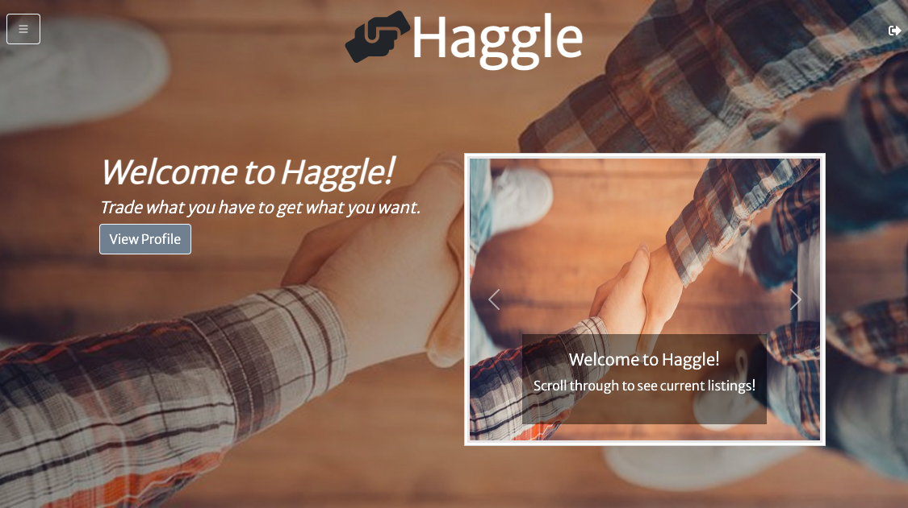
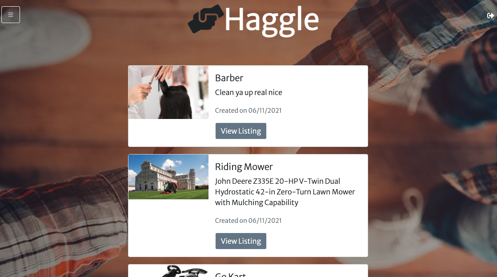
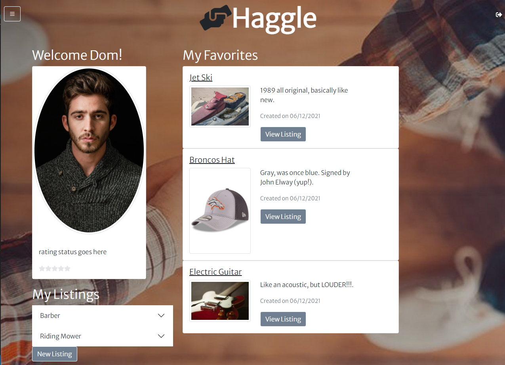

# 

## Description

This application allows users to trade goods and services for other goods and services on a cashless/currency-less platform. Within the application, a user can toggle through listings and communicate with other users within the app to haggle for items/services they are interested in.

With COVID-19 and the financial burden brought upon many in the past year, this application is intended to assist in helping users acquire needed items with what they currently own and can part ways with.

Main challenges faced when creating this application were creating fully functional user authentication, in app messaging, and refactoring our code to use React. For future improvements, we would like to create a rating system for each user based on their haggle transactions, location settings, and a mobile application.

## Table of Contents

- [Usage](#usage)
- [Technolgies Utilized](#Technologies-Utilized)
- [Deployed Apllication](#Deployed-Application-Link)
- [Credits](#credits)
- [Contributors](#Contributors)
- [License](#license)

## Usage

As a user, you will begin on the homepage that contains a carousel of listings, a sign-up option, and navbar to login if an account has already been created. In addition, the non logged-in user can also see a list of all listings when clicking on the "Listings" link in the navbar. To further interact with the listings, the user will need to login or sign-up by clicking on the "Login" or "Sign-Up" link in the navbar.

When logging in, the user will need their email and password. When creating a new account, the user will need to enter their name, email, password, and select a personal photo.

Once logged in, the user will be directed to their profile. This profile page gives them the ability to create a listing, view their current listings, delete a listing, and view any listing they have marked as a favorite. If the user clicks a specific listing to view it (personal listing), they will be able to edit the listing as well. If a listing is clicked under the favorites list, this will take them to that listing and provide the opportunity to begin the haggle process for that item/service.

From the profile page the user can re-visit the "Listings" link in the navbar. If they select a specific listing from the list, it will now show them the listing information and the ability to express interest in the item/service.

When expressing interest in a listing, a prompt will ask the user what item/service of theirs they would like to offer for the iterested item/service. Once an item/service has been selected, both items/services will be marked as pending. The offering user will be able to message the other user in regards to the haggle. If a deal is made, the users will then be prompted to mark their items as accepted and no longer available. The users will further discuss on how they would like to complete the transaction outside of the application.

## Technologies-Utilized

- [JavaScript](https://developer.mozilla.org/en-US/docs/Web/JavaScript)
- [Node.js](https://nodejs.org/en/)
- [express-handlebars](https://www.npmjs.com/package/express-handlebars) 
- [React](https://reactjs.org/)
- [MongoDB](https://www.mongodb.com/)
- [mongoose](https://www.npmjs.com/package/mongoose)
- [dotenv package](https://www.npmjs.com/package/dotenv)
- [bcrypt package](https://www.npmjs.com/package/bcrypt) 
- [express-session](https://www.npmjs.com/package/express-session)
- [multer s3](https://www.npmjs.com/package/multer-s3)
- [Passport](http://www.passportjs.org/)
- [Bootstrap](https://getbootstrap.com/docs/5.0/getting-started/introduction/)
- [jQuery](https://code.jquery.com/)
- [Font Awesome](https://fontawesome.com/)

## Deployed-Application-Link

- [Deployed Link](https://proj-three-haggle.herokuapp.com/)

## Screenshots of the application:

### Homepage:

### Listings:

### Profile:

## Contributors

* [domrafiti](https://github.com/domrafiti)

* [glchavez](https://github.com/glchavez)

* [bahuisken](https://github.com/bahuisken)

* [Kblack4290](https://github.com/Kblack4290)

## Credits

I would like to provide credit to [The Denver Univeristy Coding Bootcamp](https://bootcamp.du.edu/coding/) for providing me with the materials, intstructions, and one-on-one assistance to perform this project.

Recognition is also given to [Nathaniel Woodbury](https://www.youtube.com/watch?v=IUw_TgRhTBE) for his youtube video on authentication with React. This video provided a basic understanding of starting code to create fully functioning authentication in our application.

## License

Copyright &copy; 2021 Giovany Chavez, Brice Huisken, Dominick Rafiti, Keith Black

Permission is hereby granted, free of charge, to any person obtaining a copy
of this software and associated documentation files (the "Software"), to deal
in the Software without restriction, including without limitation the rights
to use, copy, modify, merge, publish, distribute, sublicense, and/or sell
copies of the Software, and to permit persons to whom the Software is
furnished to do so, subject to the following conditions:

The above copyright notice and this permission notice shall be included in all
copies or substantial portions of the Software.

THE SOFTWARE IS PROVIDED "AS IS", WITHOUT WARRANTY OF ANY KIND, EXPRESS OR
IMPLIED, INCLUDING BUT NOT LIMITED TO THE WARRANTIES OF MERCHANTABILITY,
FITNESS FOR A PARTICULAR PURPOSE AND NONINFRINGEMENT. IN NO EVENT SHALL THE
AUTHORS OR COPYRIGHT HOLDERS BE LIABLE FOR ANY CLAIM, DAMAGES OR OTHER
LIABILITY, WHETHER IN AN ACTION OF CONTRACT, TORT OR OTHERWISE, ARISING FROM,
OUT OF OR IN CONNECTION WITH THE SOFTWARE OR THE USE OR OTHER DEALINGS IN THE
SOFTWARE.